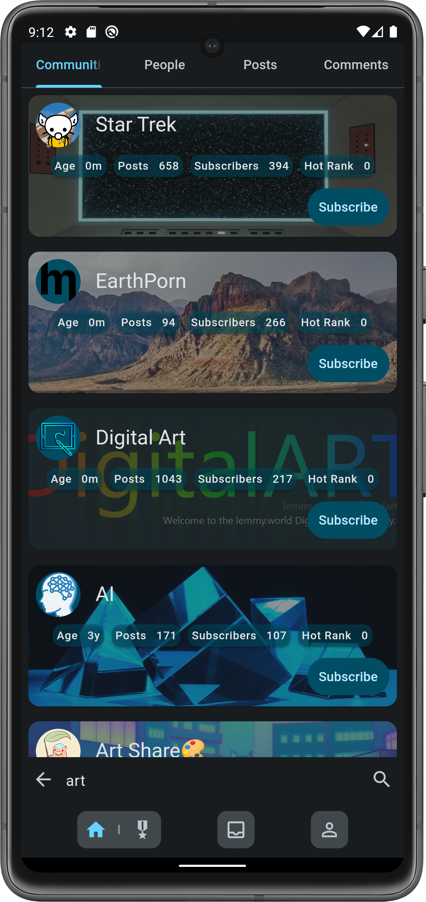
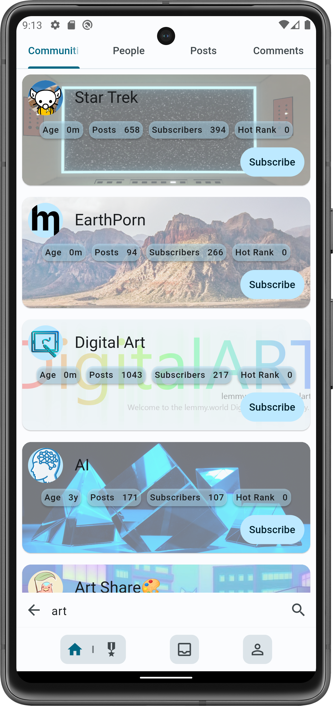

# Muffed

  

A Lemmy client written in flutter with a focus on usability and privacy.

[Join the Muffed Lemmy community](https://sh.itjust.works/c/muffed)

## Screenshots

  
  
  

  
  
  

# Project Status

Muffed is currently in **very** early development. It is being actively worked on and may undergo
significant changes.

## IOS Status

The IOS version should be released around 26/11

# Contributing

Contributions are welcome