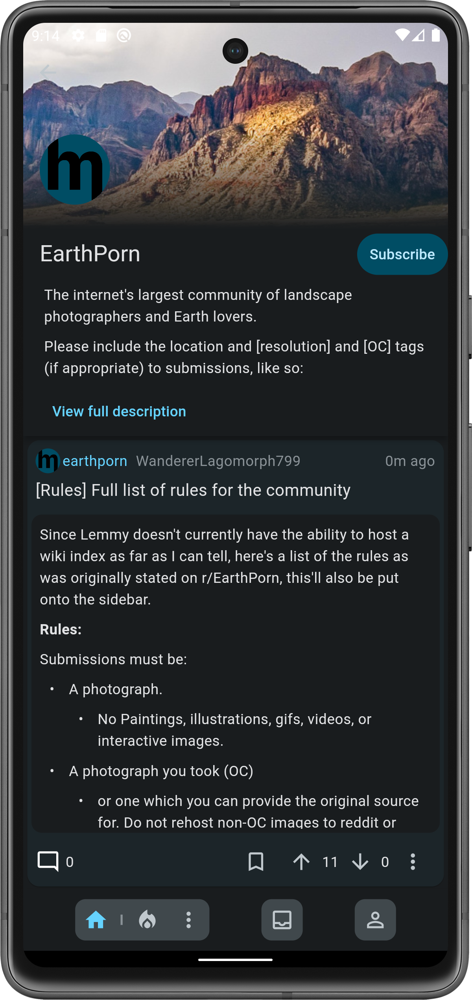
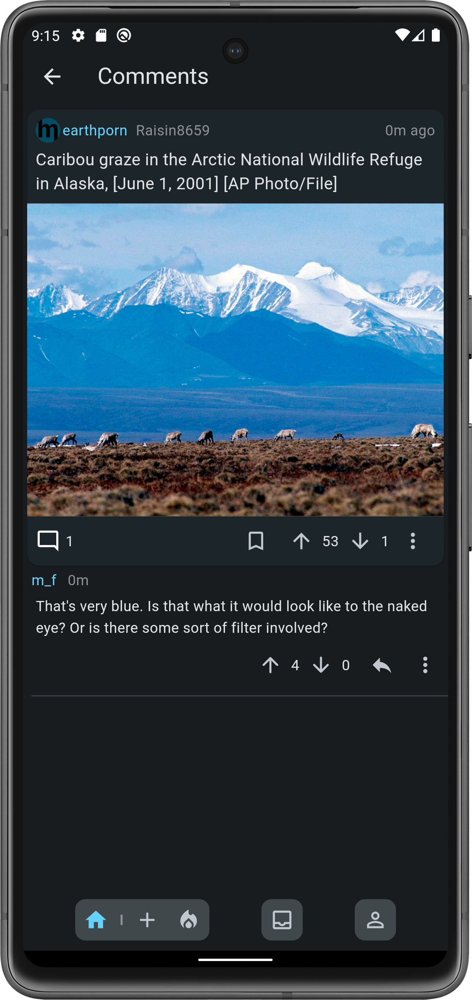
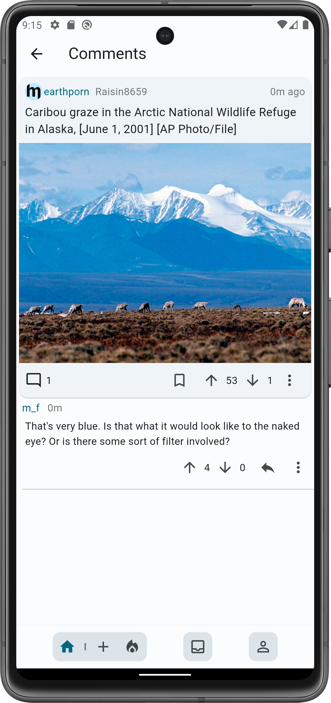

# Muffed

  

A decentralised reddit alternative that works on the Lemmy/Activity-pub network.

[Join the Muffed Lemmy community](https://sh.itjust.works/c/muffed)

# Download

  

To easily keep up with the latest verion - [Get it on Obtanium](https://github.com/ImranR98/Obtainium)

## Screenshots

  
  
  

  
  
  

# Features

## Privacy 🔒

Muffed just simply does not contain any sort of advertisements or tracking.

**This does not include the servers the user may interact with*

## Active Development 💯

Muffed is always being worked on and improved.

## Intuitive User Interface ✨

Muffed is designed with the user experience in mind. Buttons are located at the bottom of the screen
and change automatically for relevance.

## Customisable theme 🎨

Muffed allows the user to choose the color they want the theme to be based off. By default on phones
running Android 12 or higher Muffed will theme from Material You (bases the colors off of the phone
wallpaper)

# Project Status

Muffed is currently in **very** early development. It is being actively worked on and may undergo
significant changes.

## IOS Status

Due to Apples restrictions, the iOS version will not be released until November.

# Contributing

Contributions are welcome
