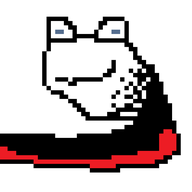
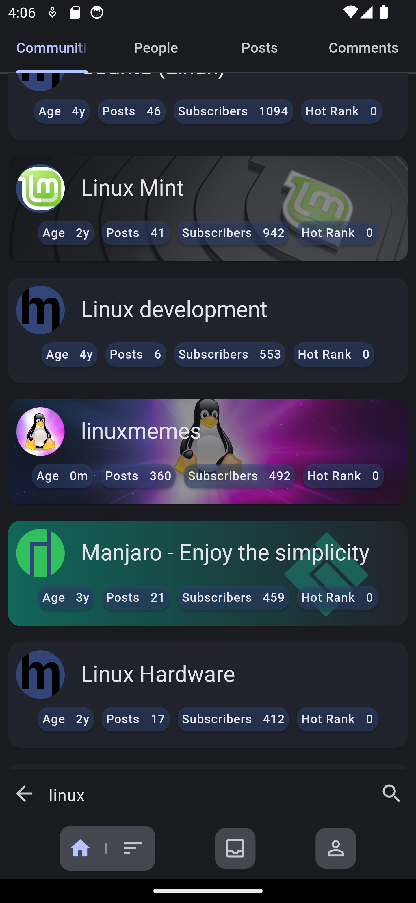
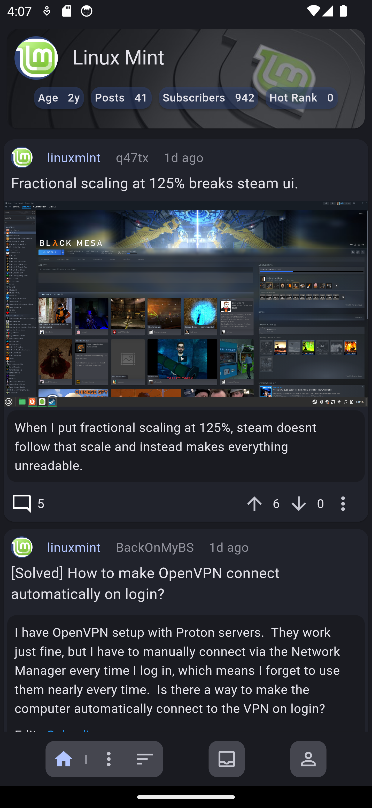
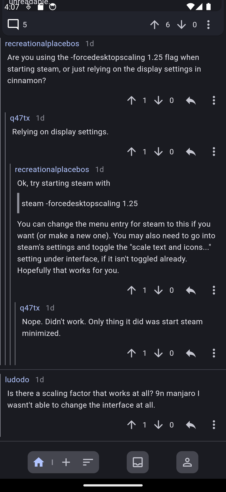
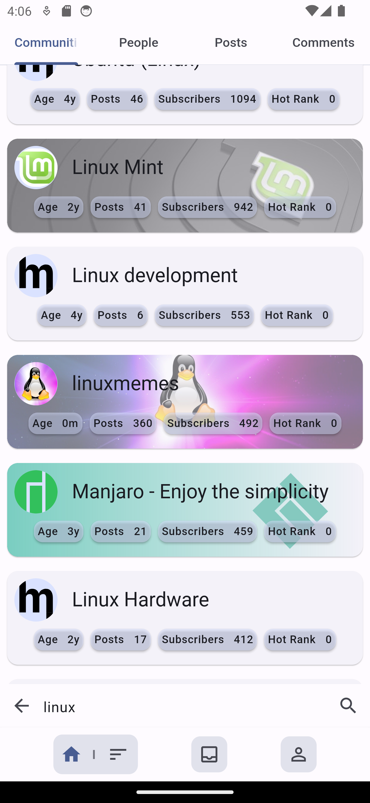
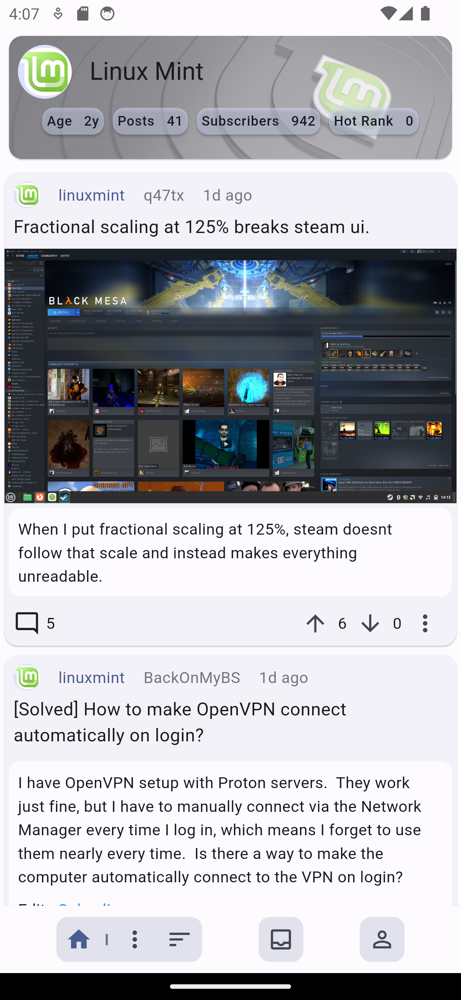
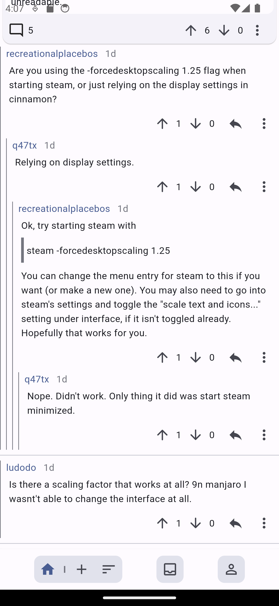

# muffed

  

A Lemmy client written in flutter with a focus on usability and privacy.

## Screenshots

  
  
  

  
  
  

# Project Status

Muffed is currently in **very** early development. It is being actively worked on and may undergo significant changes.

# Contributing

Contributions are welcome

## Logo

The logo right now is temporary, If you are able to contribute a logo please email me or create a pull request
